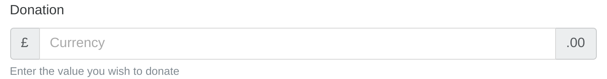

# Bootstrap-4 plugin for CakePHP-3

This plugin helps render HTML elements so they are styled correctly for Bootstrap-4.

## Installation

### Installing via composer
- Add this Bitbucket repository with the following:

```
composer config repositories.lilhermit-cakephp-plugins-bootstrap4 vcs https://bitbucket.org/lilHermit/cakephp-plugins-bootstrap4.git
```

- Add the plugin with the following command, replacing `2.*` with `dev-master` if you want the bleeding edge:

```
composer require lilhermit/cakephp-plugin-bootstrap4:2.*
```

### Setting up your Application

- Load the plugin in your `bootstrap.php`

```php
<?php
Plugin::load('lilHermit/Bootstrap4', ['bootstrap' => true]);
```

- Update your `src/View/AppView`, by either extending `lilHermit\Bootstrap4\View\BootstrapView`
or use our trait `lilHermit\Bootstrap4\View\BoostrapViewTrait`

#### Extending AppView

Make `src/View/AppView.php` extend `BootstrapView` like follows

```php
<?php
namespace App\View;

use lilHermit\Bootstrap4\View\BootstrapView;

class AppView extends BootstrapView {

}
```

#### Using our BootstrapViewTrait

Make `src/View/AppView.php` use `BootstrapViewTrait` like follows

```php
<?php
namespace App\View;

use Cake\View\View;
use lilHermit\Bootstrap4\View\BootstrapViewTrait;

class AppView extends View {

    use BootstrapViewTrait;

    public function initialize() {
        parent::initialize();

        $this->initializeBootstrap();
    }
}
```

- Copy or symlink `Bootstrap4` plugin assets to your webroot

```
bin/cake plugin assets symlink lilHermit/Bootstrap4
```

- Add Bootstrap and Plugin javascript to your layout file `<?= $this->Html->bootstrapScript(); ?>`

**NOTE**
You need to include jquery javascript separately

## Configuration

By default the plugin automatically parses the html5 date format of 2014-12-31T23:59 to disable this add the following to your app config array

```php
<?php
return [

// ... other config

        'lilHermit-plugin-bootstrap4' => [
             'skip-html5-datetime-type' => true
        ]
    ];
```

## Helpers

With the various Helpers you can style various html elements see what below. If any have been missed please feel free to create an issue on bitbucket and I'll endeavour to add them.

**Styles**

    - Form Elements, including submit button
    - Crumblist
    - Pagination
    - Flash messages `error`, `info`, `warning` & `success` are styled as dismissable alerts

### FlashHelper

The standard `default`, `error` and `success` flash messages are styled to Bootstrap Alerts. I have also implemented `warning` and `info` (`default` will render `info`).

Use the `FlashComponent` as you normally would:

```php
<?php
$this->Flash->set('This is an alert, which will render as info');
$this->Flash->info('This is an info alert');
$this->Flash->error('Something bad happened');
$this->Flash->success('Everything worked as expected');
$this->Flash->warning('Warning: Might not have saved!');
```
would render as

![alt text][alert-dismiss]

You can drop the dismiss icon by passing `noDismiss` as `true`

```php
<?php
$this->Flash->set('This is an alert, which will render as info', [ 'params' => [  'noDismiss' => true]]);
$this->Flash->info('This is an info alert', [ 'params' => [  'noDismiss' => true]]);
$this->Flash->error('Something bad happened', [ 'params' => [  'noDismiss' => true]]);
$this->Flash->success('Everything worked as expected', [ 'params' => [  'noDismiss' => true]]);
$this->Flash->warning('Warning: Might not have saved!', [ 'params' => [  'noDismiss' => true]]);
```

would render as

![alt text][alert-not-dismiss]

[alert-dismiss]: docs/img/alerts-dismissable.png "Dismissable Alerts"
[alert-not-dismiss]: docs/img/alerts-not-dismissable.png "Non dismissable Alerts"

### FormHelper

#### Additional input options

Additional `$options` are now supported by FormHelper::input

```php
<?php
$options = [
    // This text appears when a text box is empty
    'placeholder' => 'Currency',

    // This text appears below the control
    'help' => 'Enter the value you wish to donate',

    // This text appears within the control at the start
    'prefix' => '£',

    // This text appears within the control at the end
    'suffix' => '.00',
];

echo $this->Form->input('Donation', $options);

```

please see example below.



#### Datetime elements

This plugin now renders using HTML5 date functionality but you can go to CakePHP defaults of multiple dropdowns using the following `$option`

```php
<?php
echo $this->Form->input('Date', [ 'html5Render' => false ]);
```

#### Custom controls (checkboxes and radios)

By default checkboxes and radios are rendered using Bootstrap4 Custom Controls. To disable this either do at Form creation time or per input

```php
<?php
echo $this->Form->create($registerUserForm, ['customControls' => false]);

```
or
```php
<?php
echo $this->Form->input('terms_agreed', [
  'label' => 'I agree to the terms of use',
  'customControls' => false
]);
```
You can create checkboxes via the normal input method (if the type is boolean) or by forcing type
```php
<?php
echo $this->Form->input('communications_opt_in', [
  'label' => 'Please send me promotional emails',
]);
echo $this->Form->input('terms_agreed', [
  'label' => 'I agree to the terms of use',
  'type' => 'checkbox'
]);

```
You can create multiple checkboxes or radios via the `select` method (This creates the full label and container code)
```php
<?php
echo $this->Form->input('checkbox1', [
  'label' => 'My checkboxes',
  'default' => 2,
  'multiple' => 'checkbox',
  'type' => 'select',
  'options' => [
    ['text' => 'First Checkbox', 'value' => 1],
    ['text' => 'Second Checkbox', 'value' => 2]
  ]
]);
```
Or via the `multiCheckbox` or `radio` methods which just creates the checkboxes/radios so you need to add your container and labels separately
```php
<?php
echo $this->Html->tag('div', null, ['class' => 'form-group clearfix']);
echo $this->Form->label('My checkboxes');
echo $this->Html->tag('div', null, ['class' => 'custom-controls-stacked']);

echo $this->Form->multiCheckbox('checkbox2', [
    ['text' => 'First Checkbox', 'value' => 1],
    ['text' => 'Second Checkbox', 'value' => 2]],
    [
        'default' => 2
    ]);
echo $this->Html->tag('/div');
echo $this->Html->tag('/div');
```
or
```php
<?php
echo $this->Html->tag('div', null, ['class' => 'form-group clearfix']);
echo $this->Form->label('My radios');
echo $this->Html->tag('div', null, ['class' => 'custom-controls-stacked']);

echo $this->Form->radio('radio1', [
    ['text' => 'First Radio', 'value' => 1],
    ['text' => 'Second Radio', 'value' => 2]],
    [
        'label' => 'label here',
        'default' => 1
    ]);
echo $this->Html->tag('/div');
echo $this->Html->tag('/div');
```

### HtmlHelper

#### Adding Bootstrap css

The plugin provides markup for css from the official Bootstrap CDN

For adding the latest official css use to your layout

```php
<?= $this->Html->bootstrapCss(); ?>
```

If you want an older css version then pass in a string as the first parameter. For example

```php
<?= $this->Html->bootstrapCss('4.0.0-alpha.5'); ?>
```

#### Adding Bootstrap Javascript

The plugin provides markup for javascript from the official Bootstrap CDN

For adding the latest official javascript to your layout. This also adds the plugin javascript which fixes some form layout on error

```php
<?= $this->Html->bootstrapScript(); ?>
```

If you want an older javascript then pass in an array with `version` key as the first parameter. For example

```php
<?= $this->Html->bootstrapScript([ 'version' => '4.0.0-alpha.5']); ?>
```

You can also add urls that the plugin does not currently support by providing the `url` and `integrity` keys. For example to use 4.0.0-alpha4

```php
<?= $this->Html->bootstrapScript([
        'url' => 'https://maxcdn.bootstrapcdn.com/bootstrap/4.0.0-alpha.4/js/bootstrap.min.js',
        'integrity' => 'VjEeINv9OSwtWFLAtmc4JCtEJXXBub00gtSnszmspDLCtC0I4z4nqz7rEFbIZLLU'
   ]); 
?>
```

To stop the plugin javascript from being added then add the `own` key like follows

```php
<?= $this->Html->bootstrapScript([ 'own' => false ]); ?>
```

## Validation

If you use HTML5 datetime elements then the standard dateTime Validator will fail. Therefore you need to register an additional provider. To use the Bootstrap-4 validation rule you need the following in relevant Table

```php
<?php
namespace App\Model\Table;

use Cake\ORM\Table;
use Cake\Validation\Validator;
use Cake\Validation\RulesProvider;

class MyTable extends Table {

    public function validationDefault(Validator $validator) {

        // Register the provider with the correct Validation class
        $validator->provider('bootstrap4', new RulesProvider('\lilHermit\Bootstrap4\Validation\Validation'));

        // User the custom provider for the `expires` field
        $validator
            ->add('expires',  'custom', [
                'rule' => 'dateTime',
                'provider' => 'bootstrap4',
        ]);
    }
}
```